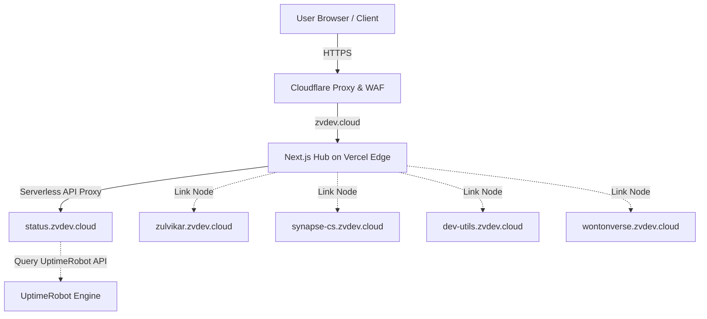

# 🌐 zvdev.cloud — Ecosystem & Central Hub Gateway

[](https://nextjs.org/)
[](https://tailwindcss.com/)
[](https://www.typescriptlang.org/)
[](https://opensource.org/licenses/MIT)

Pusat kendali ekosistem digital modular dan pintu gerbang utama (*Central Gateway Landing Page*) milik **Zulvikar Kharisma Nur Muhammad** di [zvdev.cloud](https://zvdev.cloud). Repositori ini mengintegrasikan seluruh showcase sub-proyek digital, status pemantauan waktu nyata (*live status monitoring*), dan navigasi antarmuka Bento Grid yang dioptimalkan untuk aksesibilitas tinggi dan performa ultra-ringan.

---

## 🎯 Visi & Solusi Arsitektur
Memecah fragmentasi subdomain dengan menyediakan gerbang satu pintu (*Unified Gateway*) yang aman, cepat, dan interaktif. Hub utama ini sepenuhnya decoupled dari server backend/IoT fisik guna mencegah *single point of failure* (apabila server fisik mati, web utama tetap *live* melayani pengunjung).



---

## 🛠️ Spesifikasi Teknologi (Tech Stack)
* **Framework:** Next.js (App Router) - SSG & Dynamic Route Handlers.
* **Styling:** Tailwind CSS v4.0 (Konfigurasi tema disatukan di `@theme` inline globals CSS).
* **Compiler:** Turbopack (Kecepatan kompilasi lokal berkali-kali lipat dibanding Webpack).
* **Security & Crawler Block:** Integrasi `robots.txt` khusus untuk memblokir perayap AI (*AI Crawlers* seperti GPTBot, ChatGPT-User, ClaudeBot, Claude-Web) demi privasi kode proyek internal.
* **DNS & Security Infrastructure:** Cloudflare Proxy (DDoS Protection, Caching, & WAF rules).

---

## 📁 Struktur Direktori Repositori
Struktur proyek mengikuti kaidah Next.js App Router standar industri dengan arsitektur bersih (*Clean Architecture*):

```text
├── .agents/              # Kumpulan instruksi dan konfigurasi plugin AI
├── public/               # Aset statis global & robots.txt
└── src/
    ├── app/
    │   ├── api/health/   # Route Handler API Proxy untuk CORS-free status checking
    │   ├── globals.css   # Styling global & pendefinisian design tokens Tailwind v4
    │   ├── layout.tsx    # Struktur layout HTML5 dasar & OpenGraph global
    │   └── page.tsx      # Main layout halaman utama berbasis Bento Grid
    ├── components/       # Komponen visual modular
    │   ├── Header.tsx    # Profil, deskripsi portal, dan tautan sosial media
    │   ├── ProjectCard.tsx# Kartu bento modular dengan dynamic hover states
    │   ├── InteractiveGrid.tsx # Komponen HTML5 Canvas grid efek magnetik
    │   └── SchemaMarkup.tsx # Penyedia JSON-LD Structured Data
    └── data/
        └── projects.json # Database statis terpusat untuk konfigurasi proyek
```

---

## 🚦 Alur Live Status Checker (CORS-free Proxy)
Untuk menghindari kendala browser CORS, pemeriksaan status server-side menggunakan alur tersaring:
1. Client Browser mengirim request ke endpoint lokal: `/api/health?id=[id]`.
2. Serverless Function Next.js menerima parameter dan mencocokkan target di `EXTERNAL_ENDPOINTS`.
3. Serverless Function menembak langsung ke `status.zvdev.cloud` (Node-Guard Monitor API berbasis UptimeRobot) dengan timeout maksimal 3 detik.
4. **Fallback & Graceful Degradation:** Jika API utama mati atau timeout di lingkungan pengembangan lokal, API akan mengembalikan status mock dari `MOCK_STATUSES` agar desainer dapat melihat perilaku visual lampu indikator.

---

## ♿ Aksesibilitas (WCAG AA) & SEO
Dibuat dengan kepedulian penuh terhadap kegunaan akses pembaca layar (screen readers) dan indeks Google:
* **JSON-LD Schema Markup:** Menyediakan metadata tipe `Person` (Portofolio Pengembang) dan `CollectionPage` (Kumpulan Subdomain Proyek) yang disisipkan otomatis di `<head>`.
* **Navigasi Keyboard:** Seluruh tautan sosial dan tombol luar dibekali kelas `focus-visible:ring-2` dengan outline pendaran neon cyan/violet yang sangat jelas saat diakses menggunakan tombol `Tab`.
* **Aria-Labels:** Seluruh tombol navigasi eksternal memiliki atribut label yang menjelaskan arah tujuan secara eksplifik (misal: `"Kunjungi aplikasi Synapse-CS Inbox"`).

---

## 🚀 Pengembangan Lokal (Local Development)

### 1. Prasyarat
Pastikan Anda sudah menginstal Node.js versi terbaru (direkomendasikan versi $\ge 20.x$) dan npm.

### 2. Instalasi Dependensi
```bash
npm install
```

### 3. Menjalankan Server Lokal (Dev Mode)
```bash
npm run dev
```
Buka [http://localhost:3000](http://localhost:3000) di browser Anda untuk melihat hasilnya.

### 4. Build & Validasi Linter
Sebelum melakukan commit ke repositori utama, pastikan build produksi selesai dengan sukses tanpa peringatan tipe data:
```bash
npm run lint
npm run build
```

---

## 🛸 Workflow Git & Branching Strategy
Repositori ini melarang commit langsung ke branch utama. Ikuti aturan alur kerja Git berikut secara disiplin:

```text
  (develop)  ──────○─────────○────── (Fitur Baru/Perbaikan Bug)
            /         \       \
(develop)  ○───────────○───────○──── (Branch Basis Integrasi)
                        \       \
 (master)  ──────────────○───────○── (Branch Rilis Produksi / Live Web)
```

1. **Branch Utama:**
   - **`develop`**: Branch utama untuk pengumpulan kode integrasi harian. Seluruh branch fitur (`feat/`) dan perbaikan (`fix/`) wajib diarahkan ke branch ini.
   - **`master`**: Branch rilis produksi stabil yang terhubung langsung ke deployment Vercel.
2. **Penamaan Branch Baru:**
   - Fitur Baru: `feat/nama-fitur-kebab`
   - Perbaikan Bug: `fix/nama-perbaikan-kebab`
   - Pemeliharaan: `chore/nama-pemeliharaan-kebab`
3. **Format Commit (Conventional Commits):**
   - Contoh: `feat(ui): add interactive canvas background`
   - Contoh: `fix(api): resolve cors handling on health proxy`
4. **Alur Rilis Ke Produksi:**
   - Lakukan merge branch develop ke master setelah seluruh linter dan build lokal terverifikasi sukses.
   - Buat penanda tag rilis (semantic versioning):
     ```bash
     git checkout master
     git merge develop
     git tag v1.x.x
     git push origin master --tags
     ```
