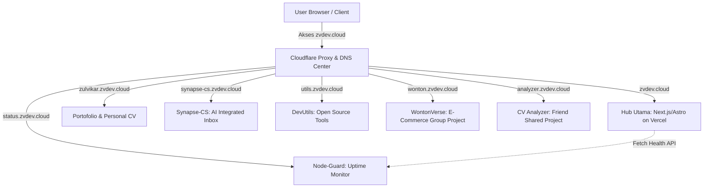
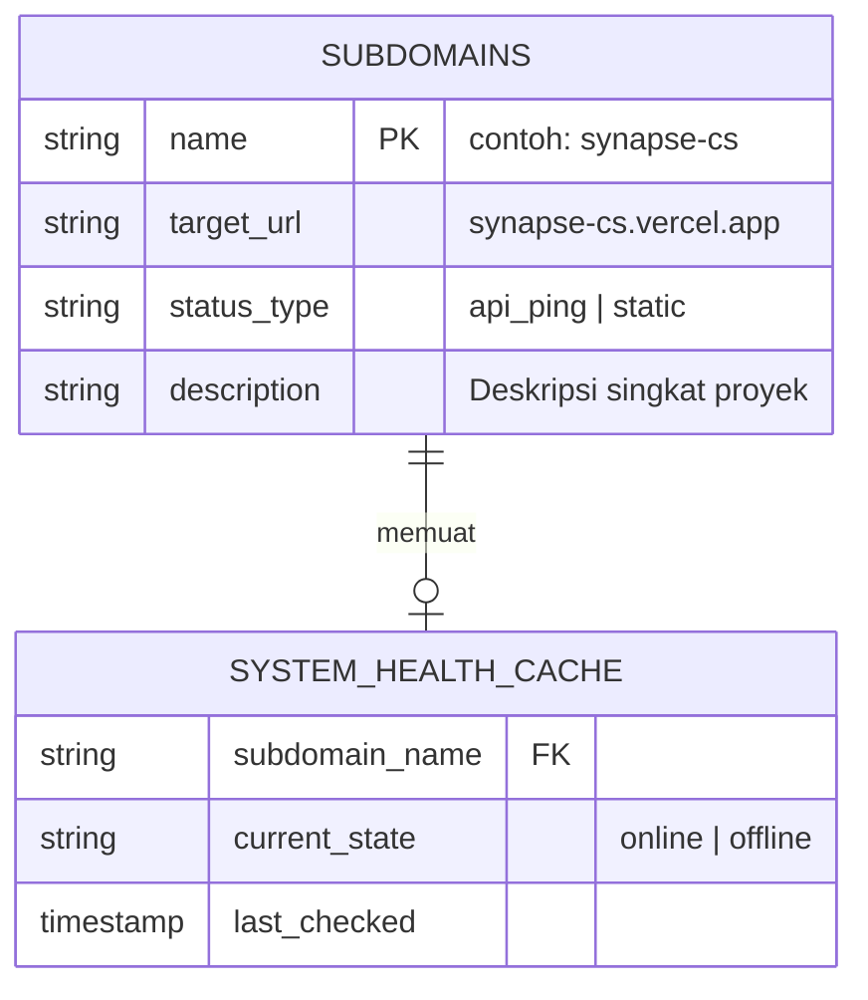

# 📑 zvdev.cloud Ecosystem & Central Hub – Product Requirements Document (PRD)

> **PRD Version:** 1.0
> **Author:** Zulvikar Kharisma Nur Muhammad
> **Status:** DRAFT
> **Date:** 2026-06-28
> **Tech Stack Focus:** Next.js (App Router), Tailwind CSS, Shadcn UI, Vercel / Cloudflare Pages

---

## 1. Overview & Vision

Dokumen ini mendefinisikan kebutuhan untuk pengembangan situs utama **`zvdev.cloud`**. Situs ini akan berfungsi sebagai pusat kendali dan pameran teknologi modular (*Engineering Lab Hub & SaaS Showcase*) yang menyatukan seluruh sub-proyek digital ke dalam satu gerbang satu pintu.

* **Problem Statement:** Memiliki banyak proyek aplikasi web, alat utilitas, sistem monitoring, dan tugas akademik yang tersebar di berbagai subdomain gratisan publik membuat portofolio teknis terlihat terfragmentasi dan kurang terintegrasi secara profesional di mata rekruter atau klien potensial.
* **Proposed Solution:** Membangun sebuah *Central Gateway Landing Page* pada domain utama `zvdev.cloud` dengan desain ala *Bento Grid* yang interaktif. Situs ini mengintegrasikan indikator status *live* dari setiap sub-proyek serta menyediakan navigasi yang mulus ke ekosistem subdomain yang ada.
* **User Persona:** Tech Leads, Rekruter/HRD Tech, Anggota Komunitas Open Source, dan Pengguna/Pelanggan dari sub-proyek ekosistem (seperti pembeli WontonVerse atau pengguna Synapse-CS).
* **Value Proposition:** Menyajikan pembuktian kompetensi rekayasa komputer, arsitektur cloud, dan manajemen sistem secara visual, terintegrasi, dan berkredibilitas tinggi dalam satu nama domain independen.

---

## 2. Core Constraints & Tech Stack (CRITICAL FOR AI AGENTS)

### 🛠️ Tech Stack Selection

* **Frontend Framework:** Next.js (App Router) atau Astro (Fokus pada kecepatan *Static Site Generation* tinggi).
* **Styling & UI Components:** Tailwind CSS + `shadcn/ui` + Aceternity UI (untuk efek animasi cyber/futuristik).
* **Database & Core Backend:** Serverless API via Cloudflare Workers / Next.js Route Handlers (jika memerlukan agregasi data internal).
* **DNS & Security Infrastructure:** Cloudflare Free Plan (Mengelola proteksi DDoS, caching global, dan SSL otomatis penuh).
* **Hosting & Deployment:** Vercel atau Cloudflare Pages (Menjamin performa *loading* global maksimal dengan efisiensi *free tier*).

### ⚠️ Infrastructure & Budget Constraints

* **Multi-site Isolation:** Domain utama `zvdev.cloud` tidak boleh berbagi sumber daya komputasi secara langsung dengan server internal/VPS IoT guna menghindari *single point of failure* (jika server IoT mati, web utama harus tetap *live*).
* **Free-Tier Optimization:** Seluruh arsitektur hub utama wajib memanfaatkan kapabilitas gratis dari Vercel/Cloudflare Pages tanpa biaya bulanan tambahan.
* **Propagation Cleanliness:** Pengelolaan records DNS sepenuhnya didelegasikan kepada Cloudflare Nameservers (`hunts.ns.cloudflare.com` dan `kelly.ns.cloudflare.com`) untuk menjamin perubahan subdomain aktif secara *real-time* (instan).

---

## 3. System Architecture & Component Diagram

Ekosistem `zvdev.cloud` diatur secara modular di mana setiap layanan diisolasi pada subdomain tersendiri dan diarahkan secara aman menggunakan Cloudflare Proxy.

---

## 4. Database Schema & Vector Specifications

Karena situs utama ini bersifat sebagai agregator statis berkinerja tinggi, ia tidak memiliki database relasional mandiri yang besar. Data status diambil dari *endpoint API* eksternal milik `node-guard` (`status.zvdev.cloud`).

### Data Dictionary & Technical Rules (Untuk Prompt AI)

* **JSON Data Mapping:** Semua daftar proyek, deskripsi, ikon, dan tautan subdomain wajib disimpan dalam satu file konfigurasi statis `projects.json` di dalam repositori frontend untuk mempermudah pemeliharaan (*maintenance*).
* **CORS Policy:** *Endpoint* pemantau status wajib mengizinkan *request* asal (*Origin*) dari domain `zvdev.cloud`.

---

## 5. Feature Requirements (Modular & P-Specs)

### [F-01] Responsive Bento Grid Hub

* **Priority:** P0 (Must-Have)
* **User Story:** Sebagai pengunjung web, saya ingin melihat seluruh ekosistem proyek Zulvikar dalam bentuk tata letak kotak-kotak (Bento Grid) yang responsif agar saya bisa langsung memahami diversifikasi keahlian teknologinya dalam sekali lihat.
* **Functional Requirements:**
1. Menyediakan grid layout modular yang secara otomatis menyesuaikan kolom berdasarkan ukuran layar (Mobile: 1 kolom, Tablet: 2 kolom, Desktop: 3 atau 4 kolom).
2. Setiap kartu (card) proyek harus menampilkan judul, deskripsi singkat, tag teknologi (misal: "Next.js", "AI", "PostgreSQL", "ESP32"), dan tombol akses eksternal.

### [F-02] Real-time Status Indicator Light

* **Priority:** P1 (Should-Have)
* **User Story:** Sebagai rekruter teknis, saya ingin melihat indikator lampu (hijau/merah) yang menyala secara *real-time* pada masing-masing kartu proyek untuk memastikan bahwa aplikasi-aplikasi tersebut benar-benar berjalan dan bukan sekadar mockup mati.
* **Functional Requirements:**
1. Menggunakan komponen *badge* dengan animasi pulsa (*ping animation*) khas Tailwind CSS di sudut setiap kartu proyek.
2. Frontend melakukan *client-side fetching* ringan ke API `status.zvdev.cloud` saat halaman dimuat untuk memperbarui status indikator dari komponen statis ke dinamis.

* **Error Handling:** Jika API monitoring mati atau mengalami *timeout*, sistem harus secara anggun (*graceful degradation*) mengubah warna indikator menjadi abu-abu (*Unknown*) tanpa menghentikan pemuatan teks deskripsi proyek lainnya.

### [F-03] External Project Node Mapping (Friend's Shared Subdomain)

* **Priority:** P2 (Nice-to-Have)
* **User Story:** Sebagai pemilik ekosistem, saya ingin menambahkan proyek kolaborasi (seperti *CV Analyzer* milik teman) ke dalam sistem DNS dan menampilkan kartu penjelasannya di hub utama.
* **Functional Requirements:**
1. Menyediakan slot kartu khusus bertanda *"Collaborative Project"* atau *"Hosted Node"*.
2. Klik pada kartu akan mengarah ke `analyzer.zvdev.cloud` yang secara DNS terhubung via Cloudflare ke server/Vercel pihak ketiga milik rekan pengembang.

---

## 6. User Flow & State Management

### Alur Navigasi Pengunjung

1. Pengunjung mengetik `zvdev.cloud` di peramban $\rightarrow$ Cloudflare mengarahkan ke halaman hub utama berkecepatan tinggi yang dilindungi SSL.
2. Pengunjung melihat visualisasi ekosistem bento grid.
3. Pengunjung dapat mengeklik salah satu kartu:
* Jika mengeklik kartu **Personal Portofolio**, pengguna diarahkan ke `zulvikar.zvdev.cloud` untuk membaca CV formal.
* Jika mengeklik kartu **Synapse-CS**, pengguna berpindah ke ruang simulasi aplikasi AI tersebut.

### State Management Konteks Status

* Menggunakan React state lokal di tingkat komponen kartu untuk melacak status *health-check* (`loading`, `online`, `offline`).
* Status *default* saat proses SSR/SSR awal adalah `loading` dengan elemen visual *Skeleton Loader* sebelum data *ping* API orisinal masuk.

---

## 7. Non-Functional, Security & Performance Requirements

* **Performance:** Skor performa pada Google Lighthouse wajib menyentuh angka $>95$ untuk aspek *Performance* dan *Accessibility*. Penggunaan gambar harus diminimalisasi dan dioptimalkan menggunakan format `.webp` atau `.svg` vektor.
* **Security & Cloudflare WAF:** Mengaktifkan aturan perlindungan standar Cloudflare Web Application Firewall (WAF) untuk memblokir bot berbahaya dan upaya pemindaian celah keamanan otomatis pada domain utama.
* **AI Crawler Restriction:** Sesuai kebijakan awal pada gerbang Cloudflare, seluruh akses dari bot *AI Crawler* (seperti ChatGPT, ClaudeBot, dll.) wajib diblokir menggunakan konfigurasi `robots.txt` otomatis guna melindungi privasi konten kode dan data proyek internal.